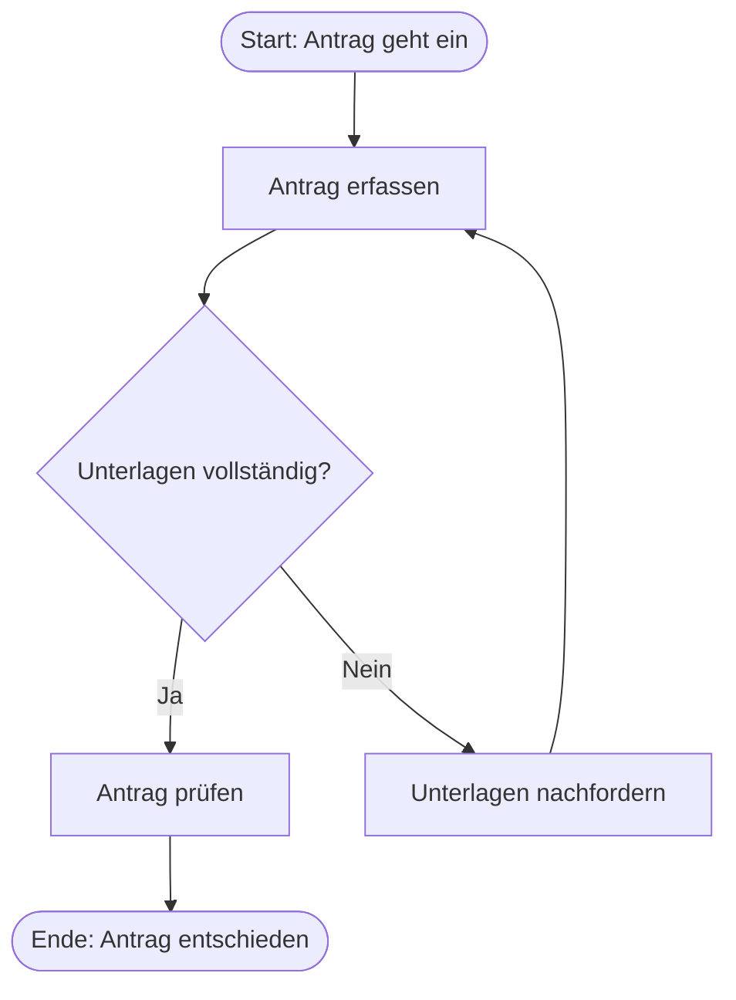

# Master-Prompt: Prozess → Mermaid-Flowchart (für Copilot)

Diesen Prompt komplett in Copilot einfügen und unter `=== INPUT ===` den zu
analysierenden Text (z. B. kopierten PDF-Inhalt, Arbeitsanweisung, Notizen)
anhängen. Die Antwort von Copilot kopieren und in **ProcessMap Studio** über
den Button „Copilot-Antwort einfügen“ übernehmen — der Mermaid-Codeblock wird
automatisch herausgelöst.

> Tipp: Der Prompt ist auch direkt im Tool hinterlegt
> (Button „Master-Prompt kopieren“).

---

```text
Du bist ein erfahrener Prozessanalyst und Experte für Mermaid.js.

AUFGABE
Extrahiere aus dem unten stehenden INPUT (Text, PDF-Inhalt, Notizen,
Arbeitsanweisung o. ä.) den beschriebenen Geschäftsprozess und gib ihn als
Mermaid-Flowchart aus.

AUSGABEFORMAT (zwingend einhalten)
- Gib AUSSCHLIESSLICH einen einzigen Mermaid-Codeblock aus
  (beginnend mit ```mermaid und endend mit ```). Kein Text davor oder danach.
- Erste Zeile im Block: flowchart TD
- Annahmen, die du treffen musstest, als Kommentarzeilen im Block notieren:
  %% ANNAHME: ...

NOTATIONS-KONVENTIONEN
1. Knoten-IDs fortlaufend: A0, A1, A2, ...
2. Alle Beschriftungen IMMER in doppelte Anführungszeichen setzen,
   z. B. A1["Rechnung erfassen"] (wichtig wegen Umlauten/Sonderzeichen).
   Keine doppelten Anführungszeichen INNERHALB von Beschriftungen verwenden.
3. Knotentypen:
   - Start/Ende:        A0(["Start: ..."])   bzw.   A9(["Ende: ..."])
   - Aktivität:         A1["Verb + Objekt, z. B. Antrag prüfen"]
   - Entscheidung:      A2{"Frage mit Ja/Nein?"}  mit Kanten -->|Ja| und -->|Nein|
   - Dokument/Daten:    A3[/"Dokumentname"/]
   - Subprozess:        A4[["Name des Teilprozesses"]]
4. Sind Rollen/Abteilungen erkennbar, gruppiere die Schritte je Rolle:
   subgraph "Rollenname"
       ...
   end
5. Beschriftungen kurz halten (max. ca. 60 Zeichen), Aktivitäten im Stil
   "Verb + Objekt" formulieren.
6. Jede Entscheidung braucht mindestens zwei beschriftete Ausgänge.
7. Genau EIN Startknoten; ein oder mehrere Endknoten.
8. Keine Styling-Anweisungen (kein classDef, style, click, linkStyle).
9. Ist der Prozess unklar oder lückenhaft: plausibel ergänzen und jede
   Ergänzung mit %% ANNAHME: kennzeichnen.

=== INPUT (hier den zu analysierenden Text/PDF-Inhalt einfügen) ===

```

---

## Erwartetes Antwortformat (Beispiel)


